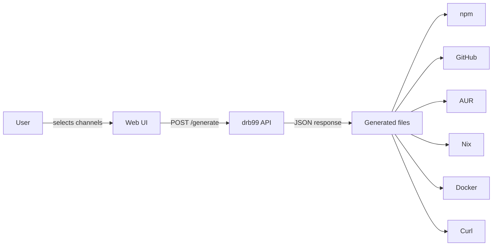

<div align="center">
  
  <p>DRB99 - DISTRIBUTE PAINLESSLY!</p>

  <a href="https://github.com/h3yng/drb99/actions/workflows/release.yml"></a>
  <a href="https://github.com/h3yng/drb99/releases/latest"></a>
  <a href="https://pkg.go.dev/github.com/h3yng/drb99"></a>
  <a href="https://github.com/h3yng/drb99/blob/main/LICENSE"></a>
</div>

---

**drb99** makes releasing less painful. Pick your channels, hit the API, get your files.

## Distribution channels

| Channel | Generated files |
|---|---|
| npm | `package.json` · `install.js` · `index.js` · `README.md` · `.gitignore` |
| GitHub Release | `.goreleaser.yml` · `release.yml` |
| AUR | `PKGBUILD` · `aur-release.yml` |
| Nix Flake | `flake.nix` |
| Docker | `Dockerfile` |
| Curl | `install.sh` |

## Architecture

The user selects distribution channels in the [web UI](https://drb99.vercel.app), which sends a `POST /generate` request to the API with the required fields. The API returns file contents as JSON, ready to be written directly to disk.



## Example request

```bash
curl -s -X POST "http://localhost:8088/api/v1/generate" \
  -H 'Content-Type: application/json' \
  -d '{
    "repo_url": "https://github.com/h3yng/drb99",
    "binary_name": "drb99",
    "runtime_image": "golang:latest",
    "platforms": ["linux-amd64", "windows-amd64"],
    "features": {
      "npm_wrapper": false,
      "goreleaser": false,
      "github_actions": false,
      "docker_container": true
    }
  }'
```

The response is a JSON object with each requested file's path and contents, ready to write to disk.

## Web UI

A hosted UI is available [here](https://drb99.vercel.app/generate).


## API

The API is publicly accessible but not yet stable, breaking changes are ongoing. Full API documentation will be published once the interface settles. Until then, using the web UI is recommended.

## Future UPdate

- More channels
- More configuration options per channel
- Multi-language support beyond Go
